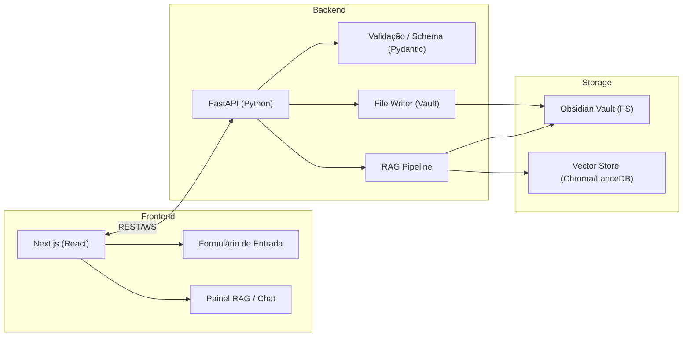
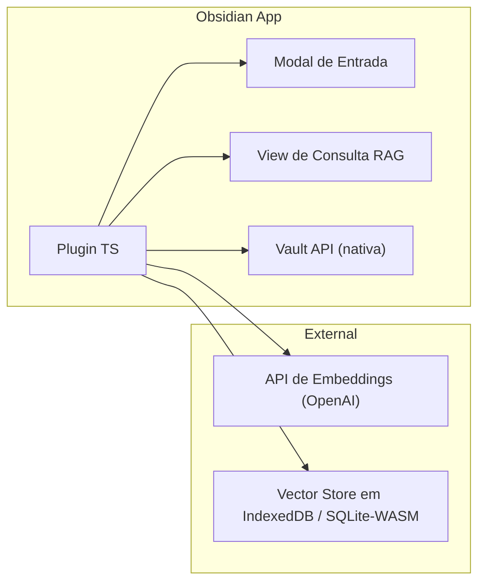
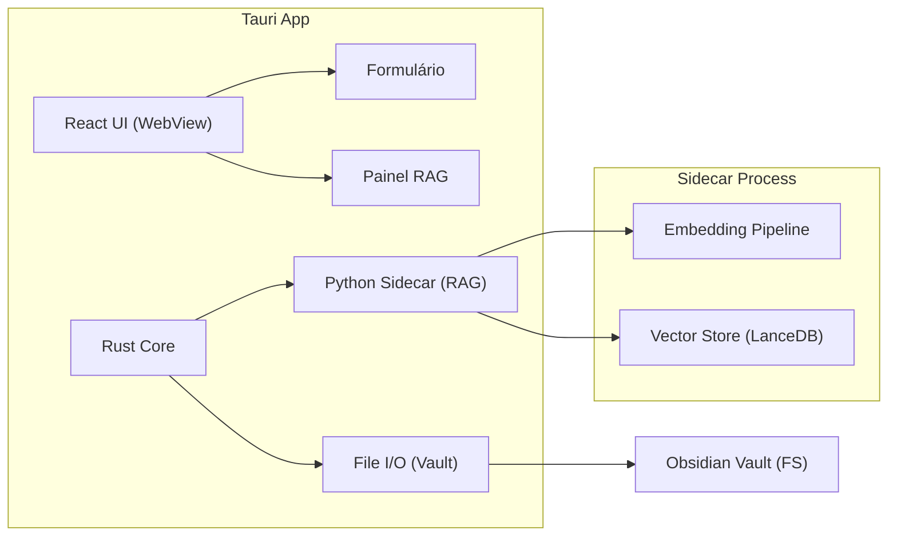
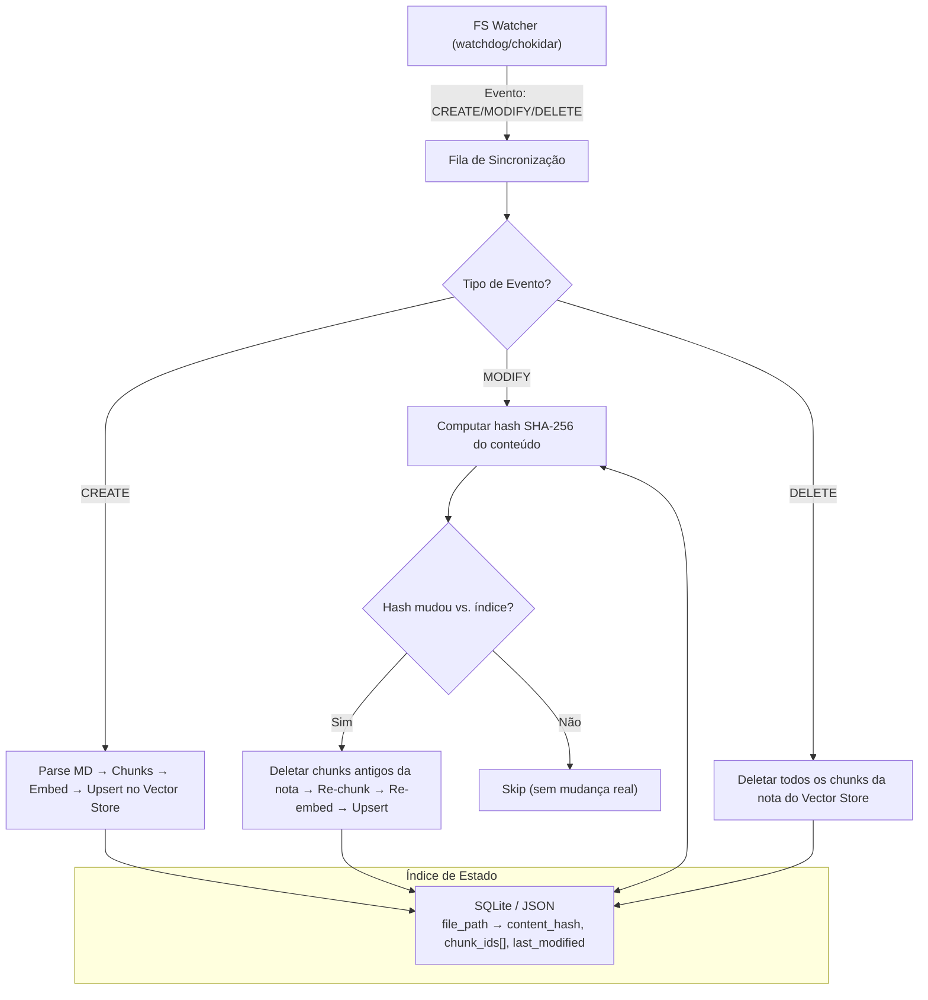
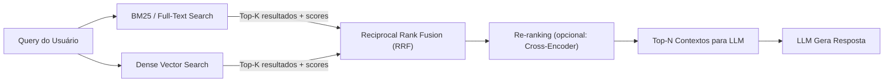
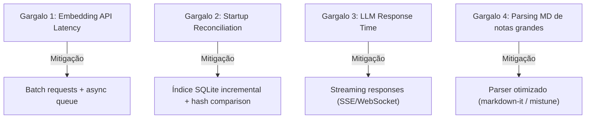

# Análise Arquitetural — Obsidian Data Entry + RAG Engine

> Documento de análise técnica pré-roadmap. Objetivo: fundamentar decisões de arquitetura antes de iniciar a implementação.

---

## 1. Opções de Arquitetura & Stack Tecnológica

Foram avaliadas três abordagens distintas, cada uma com perfis diferentes de complexidade, portabilidade e manutenção.

---

### Opção A — Web Fullstack Local (Next.js + FastAPI)



**Stack proposta:**
| Camada        | Tecnologia                                  |
|---------------|---------------------------------------------|
| Frontend      | Next.js 15 (App Router), React 19, Zod      |
| Backend       | FastAPI (Python 3.12+), Pydantic v2          |
| Embeddings    | OpenAI `text-embedding-3-small` ou Nomic Embed |
| Vector Store  | LanceDB (embedded, zero-config) ou ChromaDB  |
| Templating    | Jinja2 (server-side Markdown generation)     |
| File I/O      | `aiofiles` + `watchdog` (FS watcher)         |

**Prós:**
- Máxima flexibilidade: frontend e backend desacoplados por API REST/WebSocket
- Python é o ecossistema dominante para RAG (LangChain, LlamaIndex, frameworks maduros)
- Pydantic v2 oferece validação de schema nativa e de alta performance
- Hot-reload em dev; deploy trivial via Docker Compose

**Contras:**
- Dois runtimes (Node.js + Python) — mais overhead operacional
- Requer CORS config e gerenciamento de porta local
- Não roda "dentro" do Obsidian — é uma app separada

**Complexidade:** ⬛⬛⬛⬜⬜ (Moderada)

---

### Opção B — Plugin Nativo do Obsidian (TypeScript)



**Stack proposta:**
| Camada        | Tecnologia                                   |
|---------------|----------------------------------------------|
| Runtime       | Obsidian Plugin API (TypeScript)             |
| UI            | Obsidian UI Components + Svelte/React (embed)|
| Validação     | Zod                                          |
| Embeddings    | OpenAI API (remoto) ou Transformers.js (local)|
| Vector Store  | `vectra` (in-memory JSON), IndexedDB, orama  |
| Templating    | Handlebars / template literals               |

**Prós:**
- Integração nativa total com o Vault (API do Obsidian: `vault.create`, `vault.modify`, `vault.getAbstractFileByPath`)
- UX nativa — o usuário não sai do Obsidian
- Distribuição via Community Plugins (se open-source)

**Contras:**
- Ecossistema RAG em JS/TS é **significativamente menos maduro** que em Python
- Limitações do sandbox do Obsidian (sem acesso direto a processos nativos, sem `child_process` fácil)
- Vector stores em JS são limitados (sem Chroma/Qdrant nativos; `vectra` e `orama` são básicos)
- Embedding local via `Transformers.js` é lento e consome muita RAM no Electron
- Manutenção atrelada a breaking changes da API do Obsidian

**Complexidade:** ⬛⬛⬛⬛⬜ (Alta, pelo ecossistema RAG limitado)

---

### Opção C — Desktop Leve (Tauri + React + Python Sidecar)



**Stack proposta:**
| Camada        | Tecnologia                                   |
|---------------|----------------------------------------------|
| Shell         | Tauri 2.x (Rust)                             |
| Frontend      | React 19 + Vite, Zod                         |
| Backend/RAG   | Python sidecar (FastAPI ou script CLI)       |
| Embeddings    | OpenAI ou modelo local via `sentence-transformers` |
| Vector Store  | LanceDB (embedded)                           |
| File I/O      | Rust `std::fs` (atômico, rápido)             |

**Prós:**
- Binário único distribuível (~10-15 MB sem Python bundled)
- Rust para I/O de arquivos = escrita atômica confiável e performática
- UI React moderna sem overhead de browser completo
- Python sidecar para RAG mantém acesso ao ecossistema maduro

**Contras:**
- Complexidade de build: Rust + Node + Python = toolchain pesada
- Distribuição com Python sidecar requer bundling cuidadoso (PyInstaller ou venv embarcado)
- Curva de aprendizado em Rust (mesmo que só para glue code)

**Complexidade:** ⬛⬛⬛⬛⬛ (Alta)

---

### Tabela Comparativa

| Critério                       | A: Web Fullstack      | B: Plugin Obsidian   | C: Desktop Tauri     |
|--------------------------------|-----------------------|----------------------|----------------------|
| **Maturidade RAG**             | ⭐⭐⭐⭐⭐            | ⭐⭐                  | ⭐⭐⭐⭐⭐ (sidecar) |
| **Integração Obsidian**        | ⭐⭐ (via FS)          | ⭐⭐⭐⭐⭐             | ⭐⭐⭐ (via FS)       |
| **UX / Experiência Usuário**   | ⭐⭐⭐⭐               | ⭐⭐⭐⭐⭐             | ⭐⭐⭐⭐              |
| **Facilidade de Deploy**       | ⭐⭐⭐⭐ (Docker)      | ⭐⭐⭐⭐⭐ (plugin)    | ⭐⭐ (build complexo) |
| **Complexidade de Dev**        | ⭐⭐⭐ (moderada)      | ⭐⭐ (ecossistema)    | ⭐ (toolchain)        |
| **Performance RAG**            | ⭐⭐⭐⭐⭐             | ⭐⭐                  | ⭐⭐⭐⭐⭐            |
| **Portabilidade**              | ⭐⭐⭐⭐ (browser)     | ⭐⭐⭐ (Obsidian)     | ⭐⭐⭐⭐ (nativo)     |
| **Manutenção a longo prazo**   | ⭐⭐⭐⭐               | ⭐⭐⭐ (API instável) | ⭐⭐⭐                |

> [!TIP]
> **Recomendação:** A **Opção A (Web Fullstack)** oferece o melhor equilíbrio entre maturidade do ecossistema RAG, velocidade de desenvolvimento e flexibilidade. É a escolha pragmática para um MVP. Se a integração nativa com Obsidian for um requisito forte, a Opção B pode ser explorada em uma fase posterior como "companion plugin" que apenas aciona a API da Opção A.

---

## 2. Design do Pipeline RAG para Notas Obsidian

### 2.1 Estratégia de Chunking

Notas Obsidian são **semiestruturadas**: YAML Frontmatter (metadados) + corpo Markdown (conteúdo). O chunking precisa preservar ambos os contextos.

**Estratégia recomendada: Chunking Hierárquico por Cabeçalhos (Heading-based)**

```
┌─────────────────────────────────────────┐
│  Nota: projeto-alpha.md                 │
│                                         │
│  ┌─ Frontmatter (YAML) ─────────────┐  │
│  │ title: Projeto Alpha              │  │  ← Metadado anexado como
│  │ tags: [rag, obsidian]             │  │    contexto a TODOS os chunks
│  │ date: 2026-09-10                  │  │    desta nota (não é um chunk
│  │ status: active                    │  │    separado)
│  └───────────────────────────────────┘  │
│                                         │
│  ┌─ Chunk 1: # Visão Geral ─────────┐  │
│  │ Texto sob o heading H1...         │  │  ← chunk_id: nota_id + heading_path
│  └───────────────────────────────────┘  │
│                                         │
│  ┌─ Chunk 2: ## Arquitetura ─────────┐  │
│  │ Texto sob o heading H2...         │  │
│  └───────────────────────────────────┘  │
│                                         │
│  ┌─ Chunk 3: ## Roadmap ────────────┐   │
│  │ Texto sob o heading H2...         │  │
│  └───────────────────────────────────┘  │
└─────────────────────────────────────────┘
```

**Regras de chunking:**

| Regra | Descrição |
|-------|-----------|
| **Divisor primário** | Headings `#`, `##`, `###` (níveis configuráveis) |
| **Tamanho mínimo** | Chunks < 50 tokens são mesclados com o chunk anterior (evita fragmentação) |
| **Tamanho máximo** | Chunks > 1500 tokens são subdivididos por parágrafo com overlap de ~100 tokens |
| **Frontmatter** | Serializado como prefixo de contexto em cada chunk: `[metadata: title=X, tags=[...], date=Y]` |
| **Wikilinks** | `[[Nota Referenciada]]` são preservados como texto nos chunks para capturar relações |
| **Code blocks** | Blocos de código nunca são divididos no meio |

> [!IMPORTANT]
> **O Frontmatter NÃO deve ser um chunk isolado.** Ele deve ser injetado como contexto em cada chunk da nota. Isso permite que queries como "quais projetos com tag X falam sobre Y" funcionem corretamente no espaço vetorial.

### 2.2 Sincronização Incremental

Reindexar toda a base a cada mudança é inviável acima de ~500 notas. A solução é **indexação incremental baseada em hash de conteúdo**.



**Detalhes de implementação:**
- **Índice de estado** (`sync_index.db`): tabela SQLite com `(file_path, content_hash_sha256, chunk_ids[], last_modified_ts)`
- **Batch processing**: agrupar eventos em janelas de 2-5 segundos para evitar re-embeddings por cada keystroke (debounce)
- **Startup reconciliation**: ao iniciar a app, comparar o índice com o estado real do FS para detectar mudanças offline
- **Granularidade**: re-embed apenas os chunks alterados dentro de uma nota (diff por seção) — otimização avançada para fase 2

### 2.3 Busca Híbrida (BM25 + Dense Vectors)

A busca puramente semântica falha em queries exatas (nomes, IDs, datas). A busca puramente lexical falha em queries conceituais. A solução é **Reciprocal Rank Fusion (RRF)**.



**Implementação sugerida:**

| Componente | Tecnologia | Justificativa |
|------------|------------|---------------|
| BM25 | `rank_bm25` (Python) ou `tantivy` (Rust binding) | Leve, sem servidor, roda em memória |
| Dense Search | LanceDB / ChromaDB | Embedded, suporta filtros por metadados |
| Fusion | RRF com `k=60` (padrão) | Simples, robusto, sem hiperparâmetros sensíveis |
| Re-ranker | `cross-encoder/ms-marco-MiniLM-L-6-v2` (opcional) | Melhora precisão em top-5, mas adiciona ~200ms de latência |
| Filtros | Metadata filtering no Vector Store | Permite queries como "buscar em notas com tag=projeto AND status=active" |

---

## 3. Estruturação do Formulário e Validação de Schema

### 3.1 Schema de Frontmatter Padronizado

Definir um **schema canônico** é crítico para consistência. Exemplo em Pydantic v2:

```python
from pydantic import BaseModel, Field
from datetime import date
from enum import Enum
from typing import Optional

class NoteStatus(str, Enum):
    DRAFT = "draft"
    ACTIVE = "active"
    ARCHIVED = "archived"

class NoteType(str, Enum):
    CONCEPT = "concept"
    PROJECT = "project"
    REFERENCE = "reference"
    MEETING = "meeting"

class ObsidianFrontmatter(BaseModel):
    title: str = Field(..., min_length=3, max_length=200)
    note_type: NoteType
    tags: list[str] = Field(default_factory=list, max_length=20)
    status: NoteStatus = NoteStatus.DRAFT
    created: date = Field(default_factory=date.today)
    modified: date = Field(default_factory=date.today)
    related: list[str] = Field(
        default_factory=list,
        description="Wikilinks para notas relacionadas, ex: ['[[Nota A]]', '[[Nota B]]']"
    )
    source: Optional[str] = Field(None, description="URL ou referência de origem")
    uid: str = Field(..., pattern=r"^[a-z0-9\-]{8,36}$")
```

### 3.2 Geração de Markdown via Template

Usar **Jinja2** para compor o arquivo final:

```jinja2
---
title: {{ frontmatter.title }}
type: {{ frontmatter.note_type.value }}
tags: {{ frontmatter.tags | tojson }}
status: {{ frontmatter.status.value }}
created: {{ frontmatter.created.isoformat() }}
modified: {{ frontmatter.modified.isoformat() }}
related: {{ frontmatter.related | tojson }}
source: {{ frontmatter.source }}
uid: {{ frontmatter.uid }}
---

# {{ frontmatter.title }}

{{ body_content }}
```

### 3.3 Boas Práticas de Validação

| Prática | Implementação |
|---------|---------------|
| **Schema versionado** | Campo `schema_version: 1` no frontmatter; migração automática em versões futuras |
| **Integridade referencial** | Ao salvar, validar que `related: ['[[Nota X]]']` aponta para notas existentes no Vault |
| **Slug/filename** | Gerar automaticamente: `slugify(title) + "-" + uid[:8] + ".md"` |
| **Escrita atômica** | Escrever em arquivo temporário (`*.tmp`) → `os.replace()` para o destino final (previne corrupção) |
| **Duplicata de UID** | Verificar unicidade do `uid` no índice antes de escrever |
| **Validação client-side** | Espelhar schema Pydantic como Zod no frontend para validação instantânea |

---

## 4. Riscos Técnicos e Gargalos

### 4.1 Mapeamento de Riscos

| Risco | Severidade | Probabilidade | Mitigação |
|-------|-----------|---------------|-----------|
| **Concorrência de escrita**: app e Obsidian editam a mesma nota simultaneamente | 🔴 Alta | 🟡 Média | Escrita atômica com `os.replace()`; file locking advisory; UI mostra aviso se nota foi modificada externamente |
| **Latência de embeddings com API remota**: >500ms por chunk via OpenAI | 🟡 Média | 🔴 Alta | Batch embedding (OpenAI suporta até 2048 inputs/request); fila assíncrona; cache de embeddings por hash |
| **Alucinação em notas curtas**: notas com <100 palavras geram contexto insuficiente para respostas confiáveis | 🟡 Média | 🟡 Média | Enrichment: concatenar metadados ao chunk; threshold de confiança (se similarity < 0.7, avisar "baixa confiança"); forçar citação de fontes |
| **Drift de schema**: notas antigas não conformam com schema novo | 🟡 Média | 🔴 Alta | Campo `schema_version`; script de migração; validação lenient na leitura (warn, não fail) |
| **Custo de API**: vault grande (>5000 notas) com embeddings pagos | 🟡 Média | 🟡 Média | Modelo local (Nomic Embed v1.5: gratuito, 768d, bom desempenho); ou cache agressivo |
| **Sincronização com Obsidian Sync/Git**: conflitos de merge em Markdown | 🟡 Média | 🟡 Média | Operações append-only quando possível; metadado `modified` para detecção de conflito; merge strategy definida |
| **Tamanho do Vector Store em disco**: embeddings 1536d × 10k chunks ≈ ~60MB | 🟢 Baixa | 🟢 Baixa | LanceDB usa compressão; quantização para `int8` reduz 4x |

### 4.2 Gargalos de Performance Previstos



---

## 5. Perguntas de Alinhamento

Antes de avançar para o Plano de Ação (Roadmap), preciso de clarificações sobre os seguintes pontos:

> [!IMPORTANT]
> ### Pergunta 1 — Escopo de Uso e Volume
> Qual o tamanho estimado do Vault? (centenas, milhares ou dezenas de milhares de notas?)
> Quantos usuários simultâneos são esperados? (uso pessoal single-user ou multi-user?)

> [!IMPORTANT]
> ### Pergunta 2 — LLM e Custo
> Qual LLM será utilizado para gerar respostas no RAG? (OpenAI GPT-4o, Claude, modelo local via Ollama?)
> Existe restrição orçamentária para APIs pagas ou a preferência é por soluções 100% locais?

> [!IMPORTANT]
> ### Pergunta 3 — Plataforma de Deploy
> A aplicação rodará exclusivamente na máquina local do usuário (localhost) ou há interesse em deploy remoto (ex: servidor doméstico, VPS, cloud)?
> O Vault do Obsidian está sincronizado via Obsidian Sync, Git, ou é puramente local?

> [!IMPORTANT]
> ### Pergunta 4 — Tipos de Nota e Templates
> Quantos "tipos" de nota distintos existem no Vault (ex: reunião, projeto, conceito, referência)?
> Cada tipo terá campos de formulário diferentes ou o schema é uniforme?

> [!IMPORTANT]
> ### Pergunta 5 — Prioridade de Entrega
> Qual interface tem prioridade para o MVP: o Formulário de Entrada ou o Painel RAG?
> Existe um fluxo de uso primário que devo otimizar primeiro?

> [!IMPORTANT]
> ### Pergunta 6 — Integrações Existentes
> O Vault já possui plugins relevantes instalados (Dataview, Templater, MetaEdit)?
> Existe algum workflow atual de criação de notas que a aplicação deve respeitar/substituir?

---

## Próximos Passos

Após o alinhamento nas perguntas acima, o roadmap será estruturado nas seguintes fases:

| Fase | Escopo | Duração Estimada |
|------|--------|-----------------|
| **Fase 0** | Setup do projeto, schema canônico, PoC de escrita no Vault | 1 semana |
| **Fase 1** | Formulário de entrada funcional + validação + escrita atômica | 2 semanas |
| **Fase 2** | Pipeline RAG (chunking, embedding, vector store, busca básica) | 2-3 semanas |
| **Fase 3** | Interface de consulta / Chat RAG com streaming | 1-2 semanas |
| **Fase 4** | Busca híbrida, sincronização incremental, polimento de UX | 2 semanas |
| **Fase 5** | Testes, documentação, hardening | 1 semana |

> [!NOTE]
> As estimativas de duração assumem um desenvolvedor trabalhando part-time. Serão refinadas após alinhamento de escopo.
