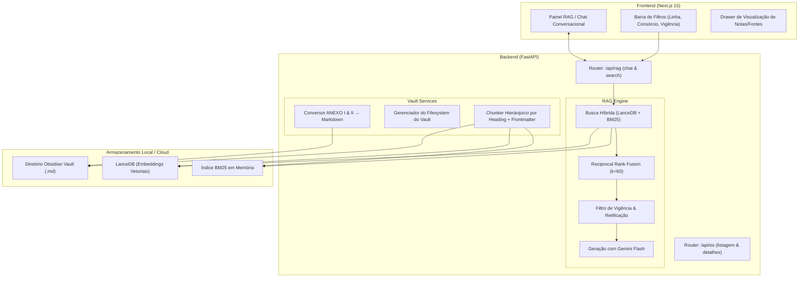

# Plano de Implementação — Bus OS Vault (MVP: RAG & Ingestão Operacional)

Construção do sistema web fullstack desacoplado para gestão e consulta semântica de Ordens de Serviço (OS) do transporte público municipal, integrando um cofre estruturado do Obsidian com pipeline RAG híbrido (LanceDB + BM25 + Gemini Flash) e interface conversacional moderna em Next.js.

---

## 1. Escopo e Prioridades do MVP

Conforme definido na análise e alinhamento:
- **Prioridade 1:** Mecanismo RAG funcional, com consciência temporal (OS vigentes vs. retificadas), busca híbrida e citações de fontes.
- **Prioridade 2:** Ingestão e conversão automatizada dos anexos reais (`referências/`): ANEXO I (matriz de viagens/quilometragem de 117 colunas sumarizada para RAG) e ANEXO II (itinerários alternativos).
- **Prioridade 3:** Interface de Chat/Consulta com filtros rápidos (Linha, Consórcio, Ano/Mês, Status) e visualização das notas do cofre.
- **Fase Posterior (Pós-MVP):** Formulário completo de cadastro web para novas OS com upload dinâmico de CSV.

---

## 2. Decisões Técnicas Críticas

> [!IMPORTANT]
> ### 1. Chave de API do Google Gemini
> Para a geração de respostas com o Gemini Flash e/ou embeddings remotos gratuitos, será necessária uma variável de ambiente `GEMINI_API_KEY`.
> Para execução local e testes do embedding, podemos utilizar `sentence-transformers/all-MiniLM-L6-v2` (100% offline, sem depender de cota) com fallback transparente para a API do Gemini.

> [!NOTE]
> ### 2. Ingestão dos Dados de Referência
> Utilizaremos os arquivos reais existentes na pasta `referências/` para popular o cofre inicial (`backend/vault/`) com:
> - A OS mestra: `174 - OS 2026.08 - agosto 2º Estudo ret 4`
> - As notas de evento extraídas da coluna de descrição
> - Os arquivos sumarizados do `ANEXO I` e `ANEXO II` convertidos para Markdown

---

## 3. Arquitetura de Módulos e Componentes



---

## 4. Etapas de Execução Propostas

### Fase 1: Fundação do Backend e Modelos de Domínio
- [NEW] `backend/app/core/config.py`: Definições de settings via `pydantic-settings` (.env, caminhos do Vault, modelo Gemini).
- [NEW] `backend/app/models/os_schema.py`: Schemas Pydantic para OS Mestra, Notas de Evento e Anexos.
- [NEW] `backend/app/models/rag_schema.py`: Schemas para mensagens de chat, filtros de busca, chunks recuperados e referências.
- [NEW] `backend/app/main.py`: Inicialização da aplicação FastAPI com middleware CORS e rotas base de health check.

### Fase 2: Ingestão e Processamento dos Dados Reais para o Vault
- [NEW] `backend/app/services/vault/csv_parser.py`:
  - Processador do **ANEXO I**: Leitura do CSV de 117 colunas, cálculo de métricas agregadas por serviço (viagens totais por período e km por tipo de dia) e escrita do `ANEXO_I_Viagens_Resumo.md`.
  - Processador do **ANEXO II**: Conversão das 8 colunas de desvios para tabelas Markdown categorizadas por serviço.
- [NEW] `backend/app/services/vault/vault_writer.py`: Utilitário de escrita atômica (`.tmp` → replace) e gestão da estrutura de pastas do cofre Obsidian:
  - `vault/00_Ordens_de_Servico/`
  - `vault/01_Notas_de_Eventos/`
  - `vault/02_Linhas_e_Servicos/`
  - `vault/03_Anexos/`
- [NEW] `backend/app/scripts/seed_vault.py`: Script inicial que ingere os arquivos da pasta `referências/` para dentro da estrutura viva do cofre.

### Fase 3: RAG Core Engine (Indexação, Busca Híbrida e Geração)
- [NEW] `backend/app/services/rag/chunker.py`: Parser hierárquico de Markdown que respeita seções `# / ##`, injeta metadados de Frontmatter e preserva Wikilinks.
- [NEW] `backend/app/services/rag/embeddings.py`: Provedor unificado de embeddings (Sentence-Transformers local com suporte opcional a Gemini Embeddings).
- [NEW] `backend/app/services/rag/vector_store.py`: Interface do LanceDB para criação de tabelas, inserção vetorial, busca por similaridade e filtragem por metadados.
- [NEW] `backend/app/services/rag/lexical_search.py`: Gerenciamento do índice BM25 (`rank_bm25`) para termos exatos (códigos de linha, números de processo).
- [NEW] `backend/app/services/rag/hybrid_retriever.py`: Fusão de resultados via Reciprocal Rank Fusion (RRF) com consciência do status de vigência da OS.
- [NEW] `backend/app/services/rag/generator.py`: Integração com a API do Google Gemini Flash via streaming de resposta com citação de notas e anexos consultados.

### Fase 4: Endpoints REST da API
- [NEW] `backend/app/api/rag.py`:
  - `POST /api/rag/chat`: Chat com streaming SSE ou resposta estruturada + fontes.
  - `POST /api/rag/search`: Busca direta de trechos e notas com filtros.
- [NEW] `backend/app/api/os.py`:
  - `GET /api/os`: Listagem de todas as OS com badges de vigência e contagem de notas de evento.
  - `GET /api/os/{uid}`: Visualização completa do documento e seus anexos.
  - `GET /api/lines`: Listagem de linhas catalogadas e suas alterações associadas.

### Fase 5: Interface Web (Next.js 15) — Painel RAG & Consulta
- [NEW] `frontend/`: Inicialização da estrutura Next.js com App Router e TypeScript.
- [NEW] `frontend/src/components/chat/ChatContainer.tsx`: Janela de mensagens, input com suporte a Markdown e exibição de respostas do assistente.
- [NEW] `frontend/src/components/chat/SourceCard.tsx`: Cartão com badges para visualização da nota de origem, OS associada e trecho citado.
- [NEW] `frontend/src/components/filters/FilterBar.tsx`: Filtros dinâmicos por Linha, Consórcio, Ano/Mês e apenas vigentes.
- [NEW] `frontend/src/components/vault/NoteViewerModal.tsx`: Modal lateral/drawer para leitura do arquivo Markdown renderizado diretamente do Vault.
- [NEW] `frontend/src/app/page.tsx`: Layout integrado de consulta.

---

## 5. Plano de Verificação e Testes

### Testes Automatizados (Backend)
```bash
# Executar a suíte de testes no ambiente backend
cd backend
pytest tests/ -v
```
- `tests/test_csv_parser.py`: Validar parsing das 117 colunas do ANEXO I e integridade das 8 colunas do ANEXO II.
- `tests/test_chunker.py`: Assegurar que o frontmatter seja injetado em cada chunk e que cabeçalhos preservem hierarquia.
- `tests/test_retriever.py`: Testar a busca híbrida garantindo que a linha `006` ou `LECD131` seja encontrada tanto por busca vetorial quanto lexical.

### Verificação Funcional (End-to-End)
1. **Seed do Vault:** Rodar script de ingestão inicial com as planilhas de `referências/` e verificar a criação dos arquivos `.md` válidos no cofre.
2. **Qualidade do RAG:**
   - Query 1 (Termo exato): *"Quais eventos ou desvios existem para a linha 104?"* → Espera-se citação dos desvios de feira e faixa reversível do ANEXO II.
   - Query 2 (Conceitual): *"Quais linhas tiveram alterações por conta de obras em túneis?"* → Espera-se identificação do Túnel Santa Bárbara (linhas 117, 165) e Túnel Marcello Alencar (linhas 167, 169).
   - Query 3 (Vigência): *"Qual a vigência do segundo estudo de agosto de 2026?"* → Espera-se recuperação da data de vigência correta e menção ao status retificado.

---

> [!TIP]
> Ao aprovar este plano, iniciaremos pela **Fase 1 (Estrutura do Backend)** e **Fase 2 (Processamento das planilhas reais para o Vault)**, deixando a base de dados pronta e indexada para a montagem do RAG.
