# Plano de Implementação — Módulo de Ingestão de Novos Dados (Data Entry)

Implementação da interface de entrada de dados padronizada e do endpoint de ingestão atômica no backend, permitindo cadastrar novas Ordens de Serviço, processar planilhas CSV (ANEXO I e II), criar notas de eventos granulares com Frontmatter YAML e atualizar automaticamente o índice do RAG.

---

## 1. Arquitetura do Fluxo de Ingestão

```mermaid
sequenceDiagram
    actor Usuario as Operador / Usuário
    participant Front as Frontend (Formulário Data Entry)
    participant API as Backend (POST /api/os/ingest)
    participant Parser as CSVAttachmentParser
    participant Writer as VaultWriter
    participant Indexer as VaultIndexer (LanceDB + BM25)

    Usuario->>Front: Preenche Cabeçalho da OS + Adiciona Notas de Eventos
    Usuario->>Front: Anexa CSVs (ANEXO I e ANEXO II)
    Usuario->>Front: Clica em "Publicar Ordem de Serviço"
    Front->>API: Envia multipart/form-data (JSON payload + CSV files)
    
    rect rgb(20, 30, 50)
        API->>Parser: Valida e sumariza ANEXO I (117 cols) e ANEXO II (8 cols)
        API->>Writer: Grava ANEXO_I_Viagens_Resumo.md e ANEXO_II_Itinerarios.md
        API->>Writer: Grava cada Nota de Evento em 01_Notas_de_Eventos/
        API->>Writer: Atualiza Hubs de Linhas em 02_Linhas_e_Servicos/
        opt Caso seja Retificação
            API->>Writer: Atualiza OS anterior (marca retificada_por e status Substituída)
        end
        API->>Writer: Grava OS Mestra em 00_Ordens_de_Servico/
        API->>Indexer: Reindexa novos chunks no LanceDB e BM25
    end

    API-->>Front: Retorna 201 Created com UIDs e estatísticas
    Front-->>Usuario: Feedback de sucesso com opção de consultar no RAG
```

---

## 2. Mudanças Propostas

### Backend (FastAPI)

#### [NEW] `backend/app/api/ingest.py`
- Endpoint `POST /api/os/ingest`:
  - Recebe formulário `multipart/form-data` com:
    - `data`: string JSON serializada com schema `OSIngestPayload` (dados da OS mestra + lista de notas de eventos).
    - `anexo_i`: arquivo opcional (`UploadFile` do ANEXO I de viagens).
    - `anexo_ii`: arquivo opcional (`UploadFile` do ANEXO II de desvios).
  - Validação rigorosa com Pydantic v2.
  - Salva cópias dos CSVs originais em `backend/data/attachments/{os_uid}/`.
  - Converte e escreve os resumos Markdown dos anexos.
  - Grava notas de evento e atualiza a linhagem da OS retificada (se houver).
  - Dispara reindexação transparente do LanceDB e BM25.

#### [MODIFY] `backend/app/models/os_schema.py`
- Adicionar schemas de entrada específicos para ingestão:
  - `NotaEventoInput`: título, tipo_evento, objeto_afetado, linhas_afetadas, consórcios, vigência, descrição, justificativa.
  - `OSIngestPayload`: metadados da OS mestra + lista de `NotaEventoInput`.
  - `OSIngestResponse`: status de criação, notas criadas, total de serviços/desvios processados.

#### [MODIFY] `backend/app/main.py`
- Registrar o novo roteador de ingestão `ingest_router` na aplicação.

---

### Frontend (Next.js 15)

#### [MODIFY] `frontend/src/app/page.tsx`
- Adicionar controle de abas de navegação no cabeçalho:
  - Aba 1: 💬 **Consulta & Chat RAG** (interface atual)
  - Aba 2: 📝 **Nova Ordem de Serviço (Entrada de Dados)**
- Alternância fluida e preservação de estado da busca.

#### [NEW] `frontend/src/components/entry/DataEntryForm.tsx`
Formulário moderno em glassmorphism dividido em seções claras:
1. **Cabeçalho da OS:**
   - Título oficial da OS (ex: `175 - OS 2026.09 - Setembro 1º Estudo`)
   - Ano/Mês de referência (ex: `2026/9`)
   - Tipo de OS (`Normal`, `Retificada`, `Temporária`)
   - Processo.Rio e Despacho
   - Datas: Publicação, Início de Vigência, Fim de Vigência (com toggle "Sem Vigência Final")
   - Se for `Retificada`: select com busca das OS existentes para vincular `retifica_os`.
2. **Anexos Operacionais:**
   - Dropzone / Upload para o **ANEXO I (Viagens e Quilometragens CSV)**
   - Dropzone / Upload para o **ANEXO II (Itinerários Alternativos CSV)**
   - Indicador visual de arquivo selecionado e tamanho.
3. **Lista Dinâmica de Notas de Eventos (Múltiplas por OS):**
   - Botão `+ Adicionar Alteração Operacional`
   - Campos de cada nota:
     - Tipo de Evento (Inclusão, Remoção, Ajuste, Retificação) com cores correspondentes.
     - Objeto Afetado (Linhas, Itinerários, Viagens, Quilometragem, Texto).
     - Linhas Afetadas (tags/códigos, ex: `LECD131`, `006`).
     - Consórcios (Intersul, Internorte, Transcarioca, Santa Cruz).
     - Descrição detalhada da alteração.
     - Justificativa técnica.
   - Listagem em cards com opção de remover ou editar antes da gravação final.
4. **Ações do Formulário:**
   - Botão de envio com feedback de progresso e validação prévia client-side.
   - Modal de confirmação ao publicar, com redirecionamento direto para visualização da OS no cofre e consulta imediata no RAG.

---

## 3. Plano de Verificação e Testes

### Testes Automatizados no Backend
- [NEW] `backend/tests/test_ingest_api.py`:
  - Testar submissão completa via `AsyncClient` com dados multipart e arquivos CSV de teste.
  - Verificar se a OS mestra, as notas de evento e os resumos de anexo foram criados no filesystem do Vault.
  - Validar se a busca RAG imediatamente localiza a nova OS inserida sem necessidade de reiniciar o servidor.

### Validação Manual no Frontend
1. Preencher uma nova OS de teste (ex: `175 - OS 2026.09 - Setembro 1º Estudo`).
2. Anexar os arquivos CSV da pasta `referências/`.
3. Adicionar 2 notas de eventos (uma de Inclusão de linha e uma de Desvio).
4. Submeter o formulário e verificar se:
   - Os arquivos `.md` aparecem nas pastas correspondentes do Vault.
   - A lista de OS na barra lateral é atualizada instantaneamente.
   - A nova linha ou evento pode ser perguntada no Chat RAG e respondida com citação.

---

> [!TIP]
> Com a aprovação deste plano, iniciaremos a implementação do endpoint de ingestão no backend e, em seguida, construiremos o formulário dinâmico no frontend.
