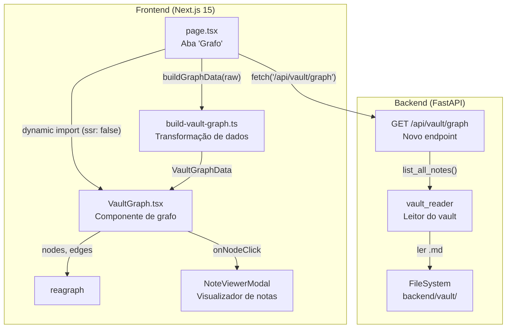
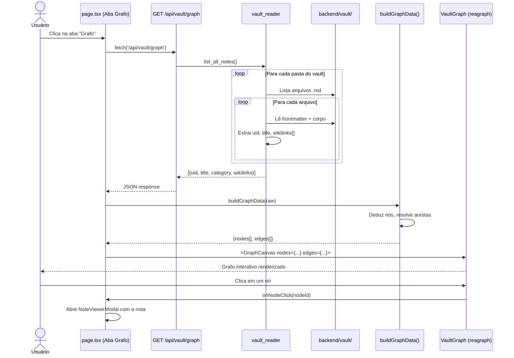

# Plano de Implementação — Aba "Grafo do Cofre" (Visualização em Rede)

Visualização interativa do vault como um grafo de notas interligadas por wikilinks, similar à vista em grafo do Obsidian. Nova aba na interface do usuário que permite explorar as relações entre Ordens de Serviço, Notas de Eventos, Hubs de Linha e Anexos de forma espacial e intuitiva.

---

## 1. Contexto e Motivação

### 1.1 O que é o Vault

O banco de dados do Bus OS Vault é um **Obsidian Vault** — uma coleção de arquivos Markdown estruturados em pastas, com frontmatter YAML para metadados e wikilinks `[[...]]` para referências cruzadas. O cofre atual contém **455 arquivos**:

| Pasta | Quantidade | Descrição |
|---|---|---|
| `00_Ordens_de_Servico/` | 4 | Notas mestra de cada OS |
| `01_Notas_de_Eventos/` | 8 | Notas de evento granulares |
| `02_Linhas_e_Servicos/` | 437 | Hubs de linha (uma por código de linha) |
| `03_Anexos/` | 6 | Resumos de ANEXO I e ANEXO II (3 subpastas × 2 arquivos) |

### 1.2 Por que um grafo?

As relações entre as entidades do vault são naturalmente em grafo:

- Uma OS **retifica** outra OS (cadeia histórica)
- Uma OS **possui** múltiplas notas de evento
- Uma OS **possui** anexos operacionais
- Cada nota de evento **afeta** múltiplas linhas de ônibus
- Cada hub de linha **procede** de uma OS (a mais recente que a tocou)

Visualizar essas relações em lista (como hoje) é limitado. Um grafo permite:
- **Explorar cadeias de retificação** (OS → OS → OS)
- **Ver a abrangência de uma OS** (quantas linhas e eventos ela toucha)
- **Identificar linhas centrais** (linhas conectadas a múltiplas OS/eventos)
- **Detectar órfãos** (notas sem conexões)

### 1.3 Referência: Obsidian Graph View

O Obsidian oferece nativamente uma vista em grafo (`Ctrl/Cmd + G`) que mostra todas as notas e suas conexões. Nosso objetivo é replicar essa experiência dentro da interface web do Bus OS Vault, com foco nas entidades de domínio do transporte público.

---

## 2. Objetivos

### 2.1 Objetivo Principal

Criar uma nova aba "Grafo do Cofre" na interface do usuário que renderize um grafo interativo com todas as notas do vault e suas relações por wikilinks.

### 2.2 Objetivos Específicos

1. **Novo endpoint backend** `GET /api/vault/graph` que retorna a estrutura de adjacência do vault (nós + arestas)
2. **Componente de grafo** usando a biblioteca `reagraph` (WebGL, React 19 compatível)
3. **Visualização por categorias** — nós coloridos por tipo de entidade (OS, Evento, Linha, Anexo)
4. **Interação** — zoom, pan, arrastar nós, clicar para abrir nota
5. **Integração** — nova aba no sistema de abas existente, sem alterar o fluxo atual

### 2.3 Não-Objetivos

- Edição de notas pelo grafo (apenas visualização e navegação)
- Algoritmos de graph analysis (PageRank, comunidades) — futuras iterações
- Grafo em 3D (apenas 2D force-directed)
- Exportação de imagem do grafo

---

## 3. Modelo de Dados

### 3.1 Nós

Cada arquivo Markdown do vault se torna um nó no grafo. Os nós são classificados em 4 categorias:

| Categoria | Cor | Ícone | Exemplo | Tamanho |
|---|---|---|---|---|
| `os` | Azul (`#38bdf8`) | `FileText` | "179 - OS 2026.09 - Setembro 1º Estudo ret" | Grande (10) |
| `evento` | Amarelo (`#f59e0b`) | `Zap` | "NOTA-179-...-01-inclusao-de-itinerarios-altern" | Pequeno (5) |
| `linha` | Verde (`#10b981`) | `Bus` | "Linha 209" | Médio (7) |
| `anexo` | Violeta (`#8b5cf6`) | `Paperclip` | "ANEXO_I_Viagens_Resumo" | Pequeno (5) |

**Justificativa das cores:** Alinhadas com os tokens existentes do design system (`--accent-cyan`, `--accent-amber`, `--accent-emerald`, `--accent-purple`).

### 3.2 Arestas

As arestas representam relações extraídas dos wikilinks `[[...]]` no corpo e frontmatter das notas:

| Origem | Destino | Tipo de Relação | Extraído de |
|---|---|---|---|
| OS | OS | `retifica` | `frontmatter.retifica_os`, `frontmatter.retificada_por` |
| OS | Evento | `possui_evento` | Body: `## Notas de Alterações` → `[[NOTA-...]]` |
| OS | Anexo | `possui_anexo` | Body: `## Anexos Operacionais` → `[[ANEXO_...]]` |
| Evento | Linha | `afeta_linha` | Body: `**Linhas Afetadas:**` → `[[Linha NNN]]` |
| Hub | OS | `procede_de` | `frontmatter.os_origem`, Body: `**OS de Origem:**` |

### 3.3 Grafo Resultante

```
                    ┌──────────────┐
                    │  OS Master   │
                    │   (raiz)     │
                    └──────┬───────┘
                           │
            ┌──────────────┼──────────────────┐
            │              │                  │
     retifica_os     eventos_vinculados    annexos
     (outra OS)      (0..N eventos)       (0..N anexos)
            │              │                  │
            │         ┌────┴────┐            │
            │         │  Evento │            │
            │         └────┬────┘            │
            │              │                 │
            │      linhas_afetadas           │
            │      (1..N linhas)             │
            │              │                 │
            │         ┌────┴────┐            │
            │         │  Hub    │            │
            │         │  Linha  │            │
            │         └─────────┘            │
            │                                │
            └──────── os_origem ─────────────┘
```

### 3.4 Exemplo de Dados

**Nós:**
```json
[
  {"id": "os-179-os-2026-09-setembro-1o-estudo-ret", "label": "179 - OS 2026.09 - Setembro 1º Estudo ret", "category": "os"},
  {"id": "evt-179-...-01-inclusao-de-itinerarios-altern", "label": "Inclusão de itinerários alternativos...", "category": "evento"},
  {"id": "linha-209", "label": "Linha 209", "category": "linha"},
  {"id": "anexo-179-anexo-i-viagens-resumo", "label": "ANEXO_I_Viagens_Resumo", "category": "anexo"}
]
```

**Arestas:**
```json
[
  {"id": "os179::evt01", "source": "os-179-...", "target": "evt-179-...-01-..."},
  {"id": "evt01::linha209", "source": "evt-179-...-01-...", "target": "linha-209"},
  {"id": "os179::anexo-i", "source": "os-179-...", "target": "anexo-179-anexo-i-viagens-resumo"},
  {"id": "os179::os178", "source": "os-179-...", "target": "os-178-os-2026-09-setembro-1o-estudo"}
]
```

---

## 4. Arquitetura

### 4.1 Diagrama de Componentes



### 4.2 Fluxo de Dados



---

## 5. Especificação da API

### 5.1 `GET /api/vault/graph`

**Descrição:** Retorna a estrutura completa do grafo do vault — todas as notas com seus UIDs, títulos, categorias e wikilinks de saída.

**Resposta (200 OK):**
```json
[
  {
    "uid": "os-179-os-2026-09-setembro-1o-estudo-ret",
    "title": "179 - OS 2026.09 - Setembro 1º Estudo ret",
    "category": "os",
    "wikilinks": [
      "os-178-os-2026-09-setembro-1o-estudo",
      "evt-179-...-01-inclusao-de-itinerarios-altern",
      "evt-179-...-02-inclusao-de-itinerario-alterna",
      "anexo-179-anexo-i-viagens-resumo",
      "anexo-179-anexo-ii-itinerarios"
    ]
  },
  {
    "uid": "evt-179-...-01-inclusao-de-itinerarios-altern",
    "title": "Inclusão de itinerários alternativos relativos à Rua da Carioca",
    "category": "evento",
    "wikilinks": [
      "os-179-os-2026-09-setembro-1o-estudo-ret",
      "linha-107",
      "linha-010",
      "linha-157"
    ]
  }
]
```

**Campos:**

| Campo | Tipo | Descrição |
|---|---|---|
| `uid` | `string` | Identificador único da nota (frontmatter `uid`) |
| `title` | `string` | Título da nota (frontmatter `title`) |
| `category` | `string` | `"os"`, `"evento"`, `"linha"` ou `"anexo"` |
| `wikilinks` | `string[]` | UIDs das notas referenciadas por `[[...]]` no corpo |

**Lógica de extração de wikilinks:**

1. **Frontmatter:** campos que contêm wikilinks (`retifica_os`, `retificada_por`, `substitui_os`, `os_origem`)
2. **Corpo:** todos os `[[...]]` extraídos por regex `\[\[([^\]]+)\]\]`
3. **Resolução:** wikilinks são resolvidos por título (nome do arquivo sem `.md`) → UID (campo `uid` do frontmatter)
4. **Deduplicação:** arestas duplicadas são eliminadas
5. **Filtragem:** wikilinks para notas inexistentes são descartados (links quebrados)

### 5.2 Módulo `vault_reader`

Nova função em `backend/app/services/vault/vault_reader.py`:

```python
def list_all_notes() -> list[dict]:
    """
    Varre todas as pastas do vault e retorna uma lista de notas
    com uid, title, category e wikilinks extraídos do conteúdo.
    """
```

**Lógica:**
1. Para cada subpasta de `VAULT_DIR`:
   - `00_Ordens_de_Servico/` → category `"os"`
   - `01_Notas_de_Eventos/` → category `"evento"`
   - `02_Linhas_e_Servicos/` → category `"linha"`
   - `03_Anexos/` → category `"anexo"`
2. Para cada arquivo `.md`:
   - Ler frontmatter YAML → extrair `uid`, `title`
   - Ler corpo → extrair wikilinks por regex
   - Resolver wikilinks por título → UID
3. Retornar lista de dicts

---

## 6. Especificação do Frontend

### 6.1 Dependência

```bash
cd frontend && npm install reagraph
```

**Justificativa da escolha:**

| Critério | reagraph |
|---|---|
| React 19 | Suportado (testado pelo mantenedor) |
| Next.js 15 | Suportado (PR #327, maio 2025) |
| Rendering | WebGL (performance com 500+ nós) |
| Layout | Force-directed 2D embutido |
| Interações | Zoom, pan, drag, click, hover — todos nativos |
| API | Declarativa (`<GraphCanvas>`) — estilo React idiomático |
| Manutenção | Ativo (junho 2026, 66K downloads/semana) |
| Bundle | ~200KB gzipped (three.js incluso) |

### 6.2 Tipos — `src/types/vault-graph.ts`

```typescript
export type NoteCategory = "os" | "evento" | "linha" | "anexo";

export interface VaultNode {
  id: string;
  label: string;
  category: NoteCategory;
}

export interface VaultEdge {
  id: string;
  source: string;
  target: string;
}

export interface VaultGraphData {
  nodes: VaultNode[];
  edges: VaultEdge[];
}
```

### 6.3 Utilitário — `src/lib/build-vault-graph.ts`

Função pura que transforma o array cru da API no formato `VaultGraphData`:

1. Mapeia cada nota para um `VaultNode` (id = uid, label = title, category = category)
2. Indexa notas por uid para resolução de arestas
3. Para cada wikilink de cada nota, cria uma `VaultEdge` (source = uid da nota, target = uid resolvido)
4. Deduplica arestas (mesmo par source→target)
5. Filtra wikilinks que não resolvem para nenhum uid existente

### 6.4 Componente — `src/components/vault/VaultGraph.tsx`

```typescript
"use client";

import { useMemo, useCallback } from "react";
import { GraphCanvas } from "reagraph";
import type { VaultGraphData } from "@/types/vault-graph";

const CATEGORY_COLORS: Record<string, string> = {
  os: "#38bdf8",       // accent-cyan
  evento: "#f59e0b",   // accent-amber
  linha: "#10b981",    // accent-emerald
  anexo: "#8b5cf6",    // accent-purple
};

const CATEGORY_SIZES: Record<string, number> = {
  os: 10,
  evento: 5,
  linha: 7,
  anexo: 5,
};

interface VaultGraphProps {
  data: VaultGraphData;
  onNodeClick?: (nodeId: string) => void;
}

export function VaultGraph({ data, onNodeClick }: VaultGraphProps) {
  const graphNodes = useMemo(
    () =>
      data.nodes.map((n) => ({
        id: n.id,
        label: n.label,
        fill: CATEGORY_COLORS[n.category] ?? "#6b7280",
        size: CATEGORY_SIZES[n.category] ?? 5,
      })),
    [data.nodes]
  );

  const graphEdges = useMemo(
    () =>
      data.edges.map((e) => ({
        id: e.id,
        source: e.source,
        target: e.target,
      })),
    [data.edges]
  );

  const handleClick = useCallback(
    ({ nodes }: { nodes: string[] }) => {
      if (nodes.length > 0 && onNodeClick) {
        onNodeClick(nodes[0]);
      }
    },
    [onNodeClick]
  );

  return (
    <div style={{ width: "100%", height: "100%", minHeight: "600px" }}>
      <GraphCanvas
        nodes={graphNodes}
        edges={graphEdges}
        layoutType="forceDirected2d"
        edgeArrowType="none"
        labelType="auto"
        onNodeClick={handleClick}
      />
    </div>
  );
}
```

**Design decisions:**
- `layoutType="forceDirected2d"` — layout orgânico, semelhante ao Obsidian
- `edgeArrowType="none"` — arestas sem seta (relações são bidirecionais na visualização)
- `labelType="auto"` — labels aparecem quando há espaço, desaparecem no zoom out
- Cores alinhadas com o design system existente
- Tamanhos proporcionais: OS maiores (mais conexões), hubs médios, eventos/anexos menores

### 6.5 Integração no `page.tsx`

**Mudanças:**

1. **Tipo da aba:** expandir união de tipos:
   ```typescript
   const [activeTab, setActiveTab] = useState<"consulta" | "entrada" | "grafo">("consulta");
   ```

2. **Novo botão de aba** (seguindo padrão existente):
   ```tsx
   <button onClick={() => setActiveTab("grafo")} style={...}>
     <Network size={16} /> Grafo do Cofre
   </button>
   ```
   - Ícone: `Network` do `lucide-react`
   - Seguir estilo visual das abas existentes (glassmorphism, glow no active)

3. **Import dinâmico** (WebGL não suporta SSR):
   ```typescript
   const VaultGraph = dynamic(
     () => import("@/components/vault/VaultGraph").then((m) => m.VaultGraph),
     { ssr: false, loading: () => <p style={...}>Carregando grafo...</p> }
   );
   ```

4. **Conteúdo da aba:**
   ```tsx
   {activeTab === "grafo" && (
     <section className="animate-fade-in" style={{ height: "calc(100vh - 120px)" }}>
       <VaultGraph data={graphData} onNodeClick={handleGraphNodeClick} />
     </section>
   )}
   ```

5. **Fetch dos dados:**
   ```typescript
   const [graphData, setGraphData] = useState<VaultGraphData | null>(null);

   useEffect(() => {
     if (activeTab === "grafo" && !graphData) {
       fetch("/api/vault/graph")
         .then((res) => res.json())
         .then((raw) => setGraphData(buildGraphData(raw)));
     }
   }, [activeTab, graphData]);
   ```

6. **Click no nó → abrir nota:**
   ```typescript
   const handleGraphNodeClick = useCallback((nodeId: string) => {
     // Buscar nota pelo uid e abrir no NoteViewerModal
     fetch(`/api/os/notes/${nodeId}`)
       .then((res) => res.json())
       .then((note) => {
         setSelectedNote(note);
         setShowNoteViewer(true);
       });
   }, []);
   ```

---

## 7. Procedimento de Implementação

### Fase 1: Backend (1 step)

| # | Tarefa | Arquivos |
|---|---|---|
| 1.1 | Criar função `list_all_notes()` em `vault_reader.py` | `backend/app/services/vault/vault_reader.py` |
| 1.2 | Criar endpoint `GET /api/vault/graph` | `backend/app/api/graph.py` |
| 1.3 | Registrar rota no `main.py` | `backend/app/main.py` |

### Fase 2: Frontend (4 steps)

| # | Tarefa | Arquivos |
|---|---|---|
| 2.1 | Instalar `reagraph` | `frontend/package.json` |
| 2.2 | Criar tipos `vault-graph.ts` | `frontend/src/types/vault-graph.ts` |
| 2.3 | Criar utilitário `build-vault-graph.ts` | `frontend/src/lib/build-vault-graph.ts` |
| 2.4 | Criar componente `VaultGraph.tsx` | `frontend/src/components/vault/VaultGraph.tsx` |

### Fase 3: Integração (2 steps)

| # | Tarefa | Arquivos |
|---|---|---|
| 3.1 | Adicionar aba "Grafo" no `page.tsx` | `frontend/src/app/page.tsx` |
| 3.2 | Teste visual e ajustes de layout | `frontend/src/app/page.tsx` |

### Fase 4: Documentação (2 steps)

| # | Tarefa | Arquivos |
|---|---|---|
| 4.1 | Atualizar CHANGELOG.md | `CHANGELOG.md` |
| 4.2 | Atualizar memory.md | `memory.md` |

---

## 8. Estratégia de Testes

### 8.1 Backend

- **Teste unitário** de `list_all_notes()`: verificar que retorna notas com uid, title, category e wikilinks
- **Teste de integração** do endpoint: `GET /api/vault/graph` retorna 200 com array válido
- **Teste de edge cases**: vault vazio, notas sem wikilinks, wikilinks quebrados

### 8.2 Frontend

- **Teste visual manual**: grafo renderiza com nós coloridos por categoria
- **Teste de interação**: zoom (scroll), pan (drag no fundo), arrastar nós, click abre nota
- **Teste de performance**: grafo com 455 nós renderiza sem lag perceptível
- **Teste de SSR**: página carrega sem erros (dynamic import com ssr: false)

### 8.3 Critérios de Aceite

- [ ] Endpoint `GET /api/vault/graph` retorna todas as 455 notas
- [ ] Grafo renderiza com nós coloridos por categoria
- [ ] Arestas representam corretamente as relações (OS→Evento, Evento→Linha, etc.)
- [ ] Zoom/pan funcionam nativamente
- [ ] Click em um nó abre a nota no `NoteViewerModal`
- [ ] Loading state exibido enquanto dados são carregados
- [ ] `tsc --noEmit` sem erros
- [ ] `next build` sem erros

---

## 9. Riscos e Mitigações

| Risco | Probabilidade | Impacto | Mitigação |
|---|---|---|---|
| **Performance com 455 nós** | Baixa | Médio | WebGL do reagraph suporta milhares de nós; 455 é tranquilo |
| **SSR quebra com WebGL** | Alta (se não tratar) | Alto | Dynamic import com `ssr: false` — padrão Next.js |
| **Bundle size (+200KB gz)** | Certa | Baixo | Aceitável para feature visual; three.js já é tree-shakeable |
| **Wikilinks quebrados** | Média | Baixo | `buildGraphData` filtra arestas com targets inexistentes |
| **Reagraph incompatível com React 19** | Baixa | Alto | Biblioteca testada pelo mantenedor com React 19; fallback: `@react-sigma/core` |
| **Layout force-directed instável** | Baixa | Médio | Parâmetros de layout ajustáveis; `limitIterations` para controlar |

---

## 10. Futuras Iterações

Estas funcionalidades estão fora do escopo atual mas podem ser adicionadas posteriormente:

1. **Filtro por categoria** — botões para mostrar/ocultar OS, eventos, linhas, anexos
2. **Filtro por vigência** — ocultar notas de OS substituídas
3. **Destaque de vizinhos** — ao clicar em um nó, destacar seus vizinhos direitos
4. **Layout alternativo** — radial, hierárquico, circular (reagraph suporta)
5. **Grafo 3D** — usar `layoutType="forceDirected3d"` para visualização espacial
6. **Métricas de grafo** — grau de cada nó, centralidade, comunidades
7. **Busca no grafo** — filtrar nós por texto (código de linha, título de OS)
8. **Exportação** — salvar grafo como imagem PNG/SVG

---

## 11. Referências

- [reagraph — GitHub](https://github.com/reaviz/reagraph)
- [Obsidian Graph View](https://help.obsidian.md/Plugins/Graph+view)
- [Design System do projeto](../frontend/src/app/globals.css)
- [Contexto do projeto](../CONTEXT.md)
- [Memória do projeto](../memory.md)
